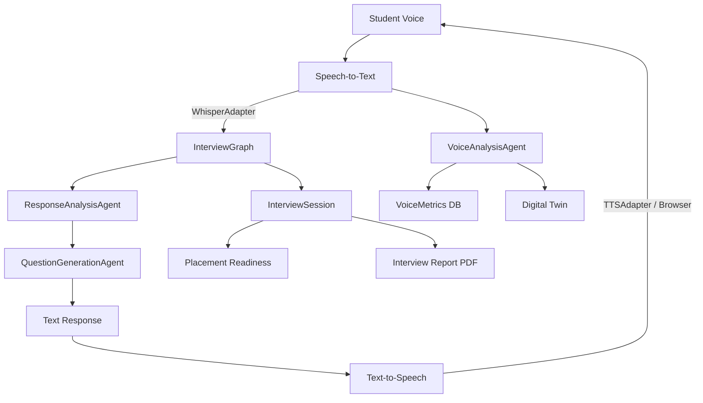

# PR-7 Voice Interview System Report

**Date:** June 11, 2026  
**Goal:** Production-grade voice interviews integrated into the existing Interview OS.

---

## Voice Architecture



---

## 1. Modified Files

| File | Change |
|------|--------|
| `prisma/schema.prisma` | Voice models + twin `confidenceScore` / `speakingSkills` |
| `src/server/core/voice/adapters/whisper-adapter.ts` | **New** Whisper STT |
| `src/server/core/voice/adapters/tts-adapter.ts` | **New** XTTS + browser fallback |
| `src/server/career-intelligence/agents/voice-interview-agent.ts` | **New** audio flow coordinator |
| `src/server/career-intelligence/agents/voice-analysis-agent.ts` | **New** pace/filler/confidence |
| `src/server/career-intelligence/evaluators/voice-analysis-evaluator.ts` | **New** heuristic analyzer |
| `src/server/career-intelligence/services/voice-interview-service.ts` | **New** orchestration layer |
| `src/app/api/voice/start|stop|transcript|metrics/route.ts` | **New** APIs |
| `src/app/api/voice/stt|tts/route.ts` | Updated with adapters + JWT auth |
| `src/components/interview/voice-interview-session.tsx` | **New** voice UI |
| `src/components/interview/voice-waveform.tsx` | **New** mic visualization |
| `src/app/(dashboard)/interview/voice/page.tsx` | **New** voice mode page |
| `src/lib/voice-client.ts` | **New** client API |
| `src/lib/interview-types.ts` | Voice types + profiles |
| `src/components/interview/interview-type-select.tsx` | Voice mode launcher |
| `src/server/career-intelligence/memory/digital-twin.ts` | Voice signal updates |
| `src/server/career-intelligence/services/interview-pdf-service.ts` | Voice sections in PDF |
| `scripts/verify-pr7.ts` | Verification script |

---

## 2. Database Changes

```prisma
VoiceInterviewSession  → links to InterviewSession (1:1)
VoiceTranscript        → student/ai spoken text
VoiceMetrics           → WPM, fillers, pauses, confidence, clarity
VoiceFeedback          → session-level voice recommendations
```

StudentIntelligenceProfile additions:
- `confidenceScore`
- `speakingSkills`

Apply: `npm run db:push`

---

## 3. API Endpoints

| Method | Route | Purpose |
|--------|-------|---------|
| POST | `/api/voice/start` | Create InterviewSession + VoiceInterviewSession |
| POST | `/api/voice/stop` | Stop recording session |
| POST | `/api/voice/transcript` | STT → submitAnswer → VoiceAnalysis → TTS |
| POST | `/api/voice/tts` | Synthesize interviewer speech |
| POST | `/api/voice/stt` | Whisper transcription |
| GET | `/api/voice/metrics?voiceSessionId=` | Aggregated voice metrics |

All routes require JWT auth.

---

## 4. UI Changes

- **Interview hub** — Voice Interview Mode section with HR/Technical/Behavioral/System Design
- **Voice profile picker** — Professional / Female / Male
- **`/interview/voice`** — Full voice session UI:
  - Mic indicator + waveform
  - Live Communication & Confidence scores
  - Transcript panel
  - TTS question playback

Panel interview remains **Coming Soon** (separate PR).

---

## 5. Voice Interview Types

| Type | Status |
|------|--------|
| HR Interview | ✅ Voice mode |
| Technical Interview | ✅ Voice mode |
| Behavioral Interview | ✅ Voice mode |
| System Design Interview | ✅ Voice mode |
| Panel Interview | ❌ Not in PR-7 |

---

## 6. Testing Steps

```bash
cd frontend
npm run db:push
npm run verify:pr7
npm run build
npm start
```

1. Login as `arjun@nexusedge.edu` / `demo1234`
2. Go to **Interviews → Start → Voice Interview Mode**
3. Pick **Technical Voice** + voice profile
4. Allow microphone access
5. Listen to TTS question → record answer → Stop & Submit
6. Verify live Communication/Confidence scores update
7. Complete interview → check report PDF for Voice Communication Analysis
8. Open **Digital Twin** — communication/confidence/speaking skills updated

---

## 7. Gap Report

| Gap | Severity | Notes |
|-----|----------|-------|
| Whisper offline | Low | Browser records audio; empty STT if Whisper down — ensure `WHISPER_URL` in prod |
| XTTS offline | Low | Browser Speech Synthesis fallback automatic |
| MediaRecorder webm | Low | Whisper must accept webm base64; may need ffmpeg transcoding in prod |
| Real-time streaming STT | Medium | Turn-based batch STT only (not streaming) |
| Panel interview | N/A | Explicitly excluded from PR-7 |
| Voice coding round | Low | Coding type excluded from voice mode by design |
| Multi-instance TTS cache | Low | No audio caching yet |

---

## Verification

```bash
npm run verify:pr7
```

**Sprint status: COMPLETE**
