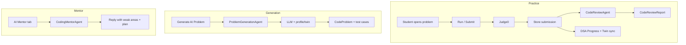

# Coding OS Sprint — NexusEdge

Transform Coding Lab into a unified **Coding Operating System** at `/coding-os` with real database-backed problems, Judge0 execution, AI generation/review, and Digital Twin integration.

## Navigation

| Route | Description |
|-------|-------------|
| `/coding-os` | Hub with tabs |
| `/coding-os?tab=practice` | Problem bank |
| `/coding-os?tab=dsa` | DSA roadmap |
| `/coding-os?tab=sql` | SQL datasets & challenges |
| `/coding-os?tab=mcq` | MCQ bank |
| `/coding-os?tab=assignments` | Faculty assignments |
| `/coding-os?tab=contests` | Timed contests |
| `/coding-os?tab=projects` | Project workspace (placeholder) |
| `/coding-os?tab=mentor` | AI Mentor |
| `/coding-os?tab=history` | Runs, submissions, reviews |
| `/coding-os?tab=analytics` | Coding analytics |
| `/coding-os/problem/[id]` | HackerRank-style IDE |

**Redirects:** `/coding`, `/coding/*` → `/coding-os?tab=practice`; `/dsa`, `/dsa/*` → `/coding-os?tab=dsa`

**Student nav:** 5th pillar **Coding OS** in `src/lib/student-nav.ts`

---

## Database Schema

Enums: `CodeDifficulty`, `CodeProblemCategory`, `CodeLanguage`, `CodeVerdict`

| Model | Purpose |
|-------|---------|
| `CodeTopic` | DSA topic taxonomy |
| `CodeProblem` | Problem statement, starter code, constraints |
| `CodeProblemTag` | Tags per problem |
| `CodeProblemTestCase` | Visible + hidden cases |
| `CodeProblemHint` | Progressive hints |
| `CodeProblemSolution` | Reference solutions |
| `CodeProblemCompany` | Company ↔ problem link |
| `CodeProblemSubmission` | Official submit + verdict |
| `CodeProblemRun` | Run-with-custom-input |
| `CodeReviewReport` | AI review (does not affect score) |
| `DsaTopicProgress` | Per-user topic completion |
| `CodingOsAssignment` | Faculty assignments |
| `CodingContest` | Contests / hackathons |
| `SqlDataset` | SQL tables + schema JSON |
| `SqlChallenge` | SQL challenges per dataset |
| `McqQuestion` / `McqAttempt` | MCQ bank + attempts |
| `CodingAnalyticsSnapshot` | Aggregated metrics |

Schema location: `prisma/schema.prisma` (Coding OS section)

---

## APIs

| Endpoint | Method | Description |
|----------|--------|-------------|
| `/api/coding-os/overview` | GET | DSA + analytics summary |
| `/api/coding-os/problems` | GET | List problems (filters) |
| `/api/coding-os/problems/generate` | POST | AI problem generation |
| `/api/coding-os/problems/[id]` | GET | Problem detail |
| `/api/coding-os/problems/[id]/run` | POST | Run code (Judge0) |
| `/api/coding-os/problems/[id]/submit` | POST | Submit + evaluate + review |
| `/api/coding-os/dsa` | GET | DSA roadmap |
| `/api/coding-os/analytics` | GET | Analytics snapshot |
| `/api/coding-os/history` | GET | Runs, submissions, reviews |
| `/api/coding-os/contests` | GET | Contest list |
| `/api/coding-os/assignments` | GET | Assignment list |
| `/api/coding-os/mcq` | GET/POST | MCQ list / submit attempt |
| `/api/coding-os/sql` | GET | SQL datasets |
| `/api/coding-os/mentor` | POST | AI mentor chat |

---

## Agents & Workflows

| Agent ID | Class | Role |
|----------|-------|------|
| `problem-generation` | ProblemGenerationAgent | Unique problems from twin, readiness, company |
| `code-review` | CodeReviewAgent | Readability, complexity, best practices |
| `coding-mentor` | CodingMentorAgent | Explain, plans, company prep |

Registered in `src/server/career-intelligence/agents/register-all.ts`.

**Services:** `src/server/coding-os/` — `problem-service`, `judge-service`, `dsa-progress-service`, `analytics-service`, `problem-generation-service`, `code-review-service`, `mentor-service`

---

## UI Components

| Component | Role |
|-----------|------|
| `coding-os-hub.tsx` | Tabbed hub + `CodingOSShell` layout wrapper |
| `coding-ide-workspace.tsx` | Split: problem \| Monaco \| mentor \| console |

Judge0 languages: Python, Java, C, C++, JavaScript, TypeScript, SQL (`src/lib/coding-os-languages.ts`)

---

## Seed Data (Real Problems)

`prisma/seed-coding-os.ts` — wired from `prisma/seed.ts`:

- 8 DSA topics
- 5 curated problems (Two Sum, Reverse String, Valid Parentheses, Max Subarray, Binary Search)
- Company profiles (Amazon, Google, Microsoft, TCS, Infosys, Wipro, Accenture)
- SQL dataset + challenges
- MCQ questions

**No mock arrays in UI** — all lists load from API/DB.

---

## Migration Plan

1. **Schema:** `npx prisma generate && npx prisma db push` (or `migrate dev`)
2. **Seed:** `npm run db:seed` (includes `seedCodingOs()`)
3. **Env:** `JUDGE0_API_URL`, `JUDGE0_API_KEY` (RapidAPI or self-hosted)
4. **Deprecate:** `src/components/feature/tab-panels.tsx` mock `CodeEditorPanel` / `DSAPracticePanel` — use `/coding-os` only
5. **Interview coding tab:** Still uses interview flow; practice moves to Coding OS

---

## Verification Checklist

- [ ] `npx prisma db push` succeeds on Supabase
- [ ] `npm run db:seed` creates topics + 5+ problems
- [ ] `/coding-os` loads practice list from DB
- [ ] Open problem → Monaco editor with starter code
- [ ] **Run** with custom input returns output/errors via Judge0
- [ ] **Submit** evaluates visible + hidden cases; stores verdict
- [ ] Submission triggers `CodeReviewReport` (check History tab)
- [ ] DSA tab shows completion % and recommended next topic
- [ ] Analytics tab shows solved count, acceptance rate, languages
- [ ] Generate AI Problem creates new `CodeProblem` row
- [ ] AI Mentor returns contextual reply
- [ ] `/coding` and `/dsa` redirect to Coding OS
- [ ] Digital Twin `codingReadiness` updates after accepted submit
- [ ] `npx tsc --noEmit` passes

---

## Remaining P2 (post-sprint)

- Faculty assignment CRUD + student submit/grade APIs
- Contest join, timer, live leaderboard
- SQL query execution endpoint (Judge0 SQL or embedded SQLite)
- MCQ answer UI in hub
- Projects tab (GitHub-linked)
- Robust per-problem judge wrappers (stdin/stdout formats)
